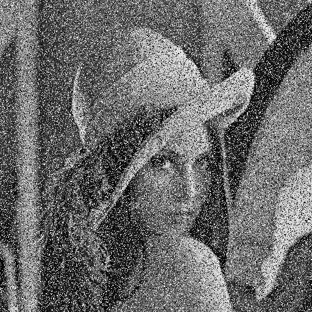
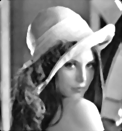

# Median Filter
My implementation of the median filter image processing algorithm. I used OpenCV to read and show the images, but all the image processing was my own code. This project was made in an effort to learn more about computer vision.

Here are some examples.\

  
  

  
  

